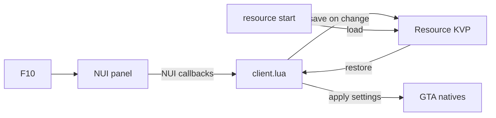

<p align="center">
  
</p>

<h1 align="center">Performance Panel — LITE</h1>

<p align="center">
  <b>A tiny, player-side NUI panel for stabilizing FPS in crowded scenes.</b><br/>
  Three sliders. A few visual switches. Saved per player.
</p>

<p align="center">
  <sub>FiveM · NUI · client-only · MIT</sub>
</p>

---

<details>
<summary><b>Guide map</b></summary>

- [One-minute setup](#one-minute-setup)
- [Controls](#controls)
- [Tuning dials](#tuning-dials)
- [Signal map](#signal-map)
- [Compatibility notes](#compatibility-notes)
- [Troubleshooting](#troubleshooting)
- [License](#license)

</details>

## One-minute setup

1) Drop the folder into your `resources/` directory.

2) Add this to your startup configuration:

```cfg
ensure Immersive_Performance_Panel-LITE
```

3) Launch, then press **F10** in-game.

That’s it — values persist per player automatically.

## Controls

| Action | Default |
| --- | --- |
| Open / Close panel | **F10** (rebindable via FiveM keybinds) |
| Close panel | **Esc** or the **✕** button |
| Reset values | **Reset** button |

## Tuning dials

This panel only touches a handful of “big lever” settings — fast to apply, easy to reason about.

### Density & distance

- **Ped Density**  
  Applied each frame via `SetPedDensityMultiplierThisFrame`.

- **Scenario Density**  
  Applied each frame via `SetScenarioPedDensityMultiplierThisFrame`.

- **LOD Distance**  
  Applied via `SetLodScale` (clamped to `0.1–1.0`).

### Visual switches

- **Decals**  
  Disables decals for the current frame via `SetDisableDecalRenderingThisFrame`.

- **Screen Blur**  
  Disables blur via `SetDisableScreenBlur`.

- **Artificial Lights**  
  Toggles lighting via `SetArtificialLightsState` (global state).  
  If something else also manages lighting, whichever runs last “wins”.

### Persistence

Each value is stored client-side using Resource KVP keys prefixed with `ipp_`.  
Open once, dial it in, and it re-applies next session.

## Signal map

A quick mental model for what happens when you interact with the UI:



## Compatibility notes

- **Frameworks:** none required.
- **Networking:** no callbacks, no permissions, no shared state.
- **Performance:** density/scenario multipliers are applied only while the panel is open; saved values are restored on start.

## Troubleshooting

<details>
<summary><b>The panel won’t open</b></summary>

- Confirm the resource started successfully.
- Try rebinding the key in FiveM keybind settings and test again.
- Ensure the `html/` files are present and loading (check F8 console for NUI errors).

</details>

<details>
<summary><b>Values don’t persist</b></summary>

- Make sure client KVP is enabled in your environment.
- Try changing a value, closing the panel, then reopening — persistence writes on change.

</details>

<details>
<summary><b>Artificial lights behave oddly</b></summary>

That toggle is a global lighting state. If another resource also manages lighting, you may want to leave this off.

</details>

## License

MIT — see `LICENSE`.

---

<p align="center"><sub>Powered by Immersive</sub></p>
